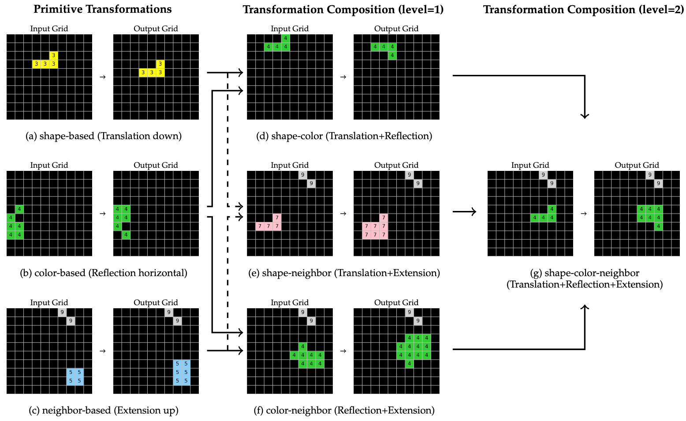

<h1 align="center">Enabling Systematic Generalization in Abstract Spatial Reasoning through Meta-Learning for Compositionality</h1>

<p align="center">
    <a href="LICENSE">  </a>
</p>

<div style="text-align: center; width: 100%;">
  <!-- Container to align the image and the caption -->
  <div style="display: inline-block; text-align: left; width: 85%;">
    
    <p style="color: gray; font-size: small; margin: 0;">
      <em>A conceptual overview of the data in SYGAR. Primitive transformations refer to basic geometric transformations (e.g., translation, reflection, extension) based on an object’s (a) shape, (b) color, or (c) proximity to a neighboring object. Pairs of these indicators, such as (d) shape+color, (e) shape+neighbor, or (f) color+neighbor, can be combined to form level-1 transformation compositions. Finally, all three indicators can be combined to form level-2 transformation compositions, based on the object’s (g) shape+color+neighbor.</em>
    </p>
  </div>
</div>

<br>

Systematic generalization refers to the capacity to understand and generate novel combinations from known components. Despite recent progress by large language models (LLMs) across various domains, these models often fail to extend their knowledge to novel compositional scenarios, revealing notable limitations in systematic generalization. There has been an ongoing debate about whether neural networks possess the capacity for systematic generalization, with recent studies suggesting that meta-learning approaches designed for compositionality can significantly enhance this ability. However, these insights have largely been confined to linguistic problems, leaving their applicability to other tasks an open question. In this study, we extend the approach of meta-learning for compositionality to the domain of abstract spatial reasoning. To this end, we introduce *SYGAR*&mdash;a dataset designed to evaluate the capacity of models to systematically generalize from known geometric transformations (e.g., translation, rotation) of two-dimensional objects to novel combinations of these transformations (e.g., translation+rotation). Our results show that a transformer-based encoder-decoder model, trained via meta-learning for compositionality, can systematically generalize to previously unseen transformation compositions, significantly outperforming state-of-the-art LLMs, including o3-mini, GPT-4o, and Gemini 2.0 Flash, which fail to exhibit similar systematic behavior. Our findings highlight the effectiveness of meta-learning in promoting systematicity beyond linguistic tasks, suggesting a promising direction toward more robust and generalizable models.

## Table of Contents
  - [Table of Contents](#table-of-contents)
  - [Abstract](#abstract)
  - [Installation](#installation)
  - [Setup](#setup)
  - [Generate Data](#generate-data)
  - [Split Data](#split-data)
  - [Train Model](#train-model)
  - [Evaluate API Models](#evaluate-api-models)
  - [License](#license)
  - [Citation](#citation)

## Setup
All code was developed and tested on Ubuntu 22.04 with Python 3.11.6.

To run the current code, we recommend to use Poetry:
```bash
poetry install                          # Install dependencies
poetry shell                            # Activate virtual environment
# Work for a while
deactivate
```

## Generate Data
To generate data for the SYGAR dataset, we provide a script that creates the dataset in the required format. The script `scripts/gen_data.py` generates the data and saves it in the specified directory. A bash script to generate 100,000 episodes can be run as follows:
```bash
bash bash_scripts/gen_data.sh
```

Alternatively, you can run the script directly with Python. The script takes several command-line arguments to customize the data generation process. The main arguments are:
```
python gen_data.py --num_samples <num-samples> --plot_freq <plot-freq>
```
where `<num-samples>` is the number of samples to generate and `<plot-freq>` is the frequency of plotting the generated samples for inspection.

## Split Data
After generating the dataset, you can split it into training, validation, and test sets. The script `scripts/split_data_systematicity.py` takes the generated dataset and splits it into the specified proportions. A bash script to split the previously generated 100,000 episodes can be run as follows:
```bash
bash bash_scripts/split_data_systematicity.sh
```

Alternatively, you can run the script directly with Python. The script takes several command-line arguments to customize the data splitting process. The main arguments are:
```
python scripts/split_data_systematicity.py --data_path <data-path> --frac_test_compositions <frac_test_compositions> --min_func_examples <min_func_examples> --no_shuffle_study_examples --num_primitives <num_primitives> --num_compositions <num_compositions> --seed 1860
```
where `<data-path>` is the path to the generated dataset, `<frac_test_compositions>` is the fraction of level-2 transformation compositions to use for testing, `<min_func_examples>` is the minimum number of samples required for each geometric transformation, `<num_primitives>` is the number of primitive transformation examples to use per indicator (shape-based, color-based, neighbor-based), and `<num_compositions>` is the number of level-1 transformation composition to use per indicator pair.

## Train Model
To train a model via MLC, you can use the script `scripts/train_mlc.py`. We also provide a bash script to train a model on the SYGAR dataset. The bash script can be run as follows:
```bash
bash bash_scripts/train_mlc.sh
```

Alternatively, you can run the script directly with Python. The script takes several command-line arguments to customize the training process. The main arguments are:
```
python scripts/train_mlc.py --data_dir <data-dir> --data_file_name systematicity_seed_<seed> --checkpoint_dir <checkpoint-dir> --wandb_dir <wandb-dir> --plot_dir <plot-dir> --wandb_name <wandb-name> --batch_size <batch-size> --nepochs <num-epochs> --seed <seeds>  
```
where `<data-dir>` is the path to the dataset, `<data-file-name>` is the prefix of the dataset files, `<checkpoint-dir>` is the directory to save the model checkpoints, `<wandb-dir>` is the directory for Weights & Biases logging, `<plot-dir>` is the directory for saving plots, `<wandb-name>` is the name for Weights & Biases logging, `<batch-size>` is the batch size for training, `<num-epochs>` is the number of epochs to train for, and `<seeds>` are the random seeds to use for training.

After training, the model will automatically be evaluated on the corresponding test set. Alternatively, you can run the script `scripts/eval_mlc_model.py` to evaluate the model on the test set.

## Evaluate API Models
Notebooks to evaluate the API models are provided in the `notebooks` directory. The notebooks are designed to be run in a Jupyter Notebook environment.

## License


This work is licensed under a [CC BY-SA 4.0](https://creativecommons.org/licenses/by-sa/4.0/).


## Citation

If you find our work helpful, you can cite this paper as:
```
@article{mondorf2025enabling,
  title={Enabling Systematic Generalization in Abstract Spatial Reasoning through Meta-Learning for Compositionality},
  author={Mondorf, Philipp and Zhou, Shijia and Riedler, Monica and Plank, Barbara},
  journal={arXiv preprint arXiv:2504.01445},
  year={2025}
}
```

[def]: #table-of-contents
